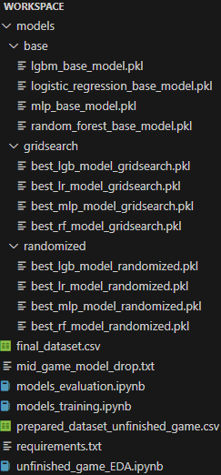

# How to configure the project

After following the instructions presented below, the structure of the project should be as shown in the following image:



## 1. Download the dataset

Click on [this link](https://www.kaggle.com/datasets/dsluciano/league-of-legends-match-statistics/data?select=final_dataset.csv) and download the compressed datasets. After that, extract the file named "final_dataset.csv".

## 2. Install the project dependencies

First of all, make sure you have Python installed. Then, install the project dependencies by typing:

```bash
pip install -r requirements.txt
```

## 3. Run the notebook in the following order to generate the missing files:

* **unfinished_game_EDA.ipynb** -> this will create the "prepared_dataset_unfinished_game.csv" file
* **models_training.ipynb** -> this will create the "models" folder with all the trained models inside different folders, depending on the training strategy
* **models_evaluation**

> [!NOTE]
> Due to the big size of several files, it was not possible to upload them to this repository. For that reason, this *readme* file helps to properly download and configure the project.
